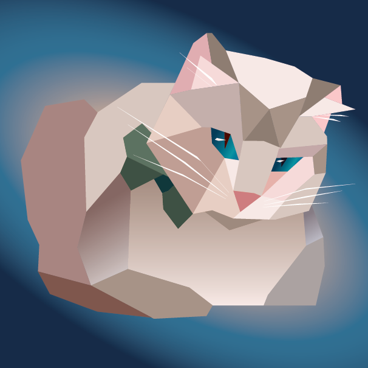
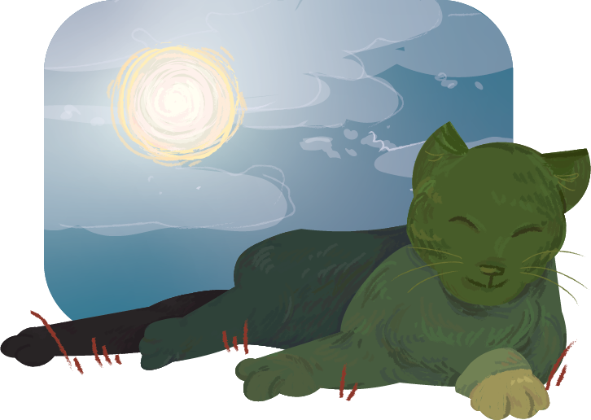
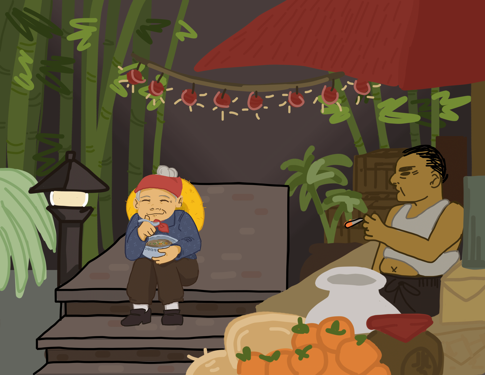
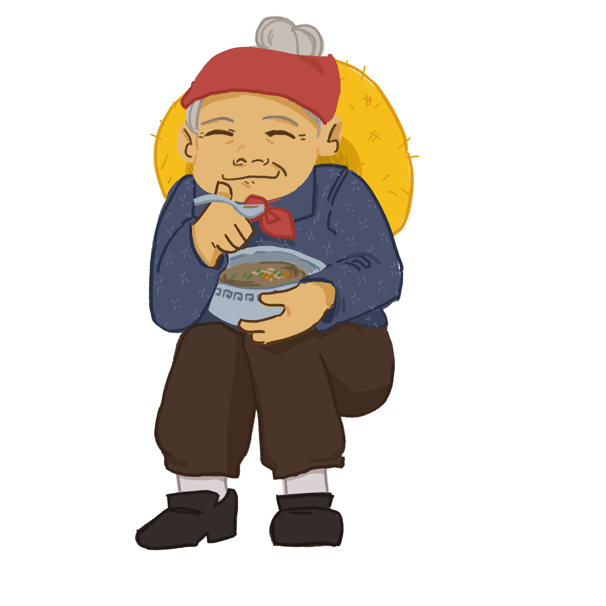

# ARTS 74 E-Portfolio

### **Illustrator Skill Test:** Low Poly Art

**Tools used:** Adobe Illustrator

This "project" was created for the low poly Illustrator skill test in the first few weeks of the quarter. I overlaid shapes on a photo reference to create this simplified, geometric look. 

The most difficult part of the process was figuring out how to choose colors that could capture all of the complicated highlights and shadows from the original photo. My favorite part of this piece is the subtle teal gradient on the cat's eyes. 

### PROJECT \#1: Photo Illustration Art

**Tools used:** Adobe Illustrator

This project involved creating an illustration that incorporated elements from the photos I took for another assignment on the Elements of Art and Principles of Design. I decided to combine a photo of a cat with a photo of a valley to create this fantasy-inspired image of a cat with grassy texture laying in the sun. 

The most difficult part of this project was creating the grass-like texture on the cat– since Illustrator is vector-based, every stroke created new anchor points that were difficult to manipulate. My favorite part of this piece is the way the cat is layered over the sky background to create a foreground that "jumps" and the illusion that the cat is as large as a hill. 

### PROJECT \#2: Surreal Collage

**Tools used:** Adobe Photoshop

This project follows the prompt of creating a collage of images that describe a part of my identity. I chose to depict the conflict between Western and Eastern influence in my artistic life as an Asian-American, with elements from both ends \(ex. Magritte painting, the character Akira from Katsuhiro Otomo's movie _Akira_\).

I had the most difficulty in coming up with a concept for the collage, and ended up centering my theme around the conflict I felt. My favorite part of this piece is the way some of the collage elements interact with one another, especially in the hands that look like they're "touching" the window from the Magritte painting. 

### PROJECT \#3: Animated Digital Painting

**Tools used:** Adobe Photoshop

This project involved developing and animating an original character and its environment. It was a partner-based project. I created and animated the character of the old woman, and my partner created and animated the market scene in the background.

The biggest challenge of this project was trying to keep the art style consistent with two teammates working on individual parts. To help, I created an initial sketch that my teammate and I referenced in our own work. Additionally, we kept each other updated on our progress and checked in with one another to make sure everything looked good. My favorite part of this project was using Photoshop's animation tools to animate the old woman's feet– I actually took a reference video of my own feet to see how they would move! 

### FINAL PROJECT: Immersive Micro Story 



**Tools used:** Adobe Photoshop, Adobe Aero, iMovie

The final project involved creating an immersive Augmented Reality \(AR\) experience that told the story of "life in the pandemic". I chose to describe the challenges of resisting the temptation to go outside and neglect the safety and health concerns of COVID-19, especially 1 year into the pandemic. The AR elements I included help add color, personality, and contrast to the otherwise "boring" and "monotonous" aspects of daily life in quarantine. With multiple tools used, I created the elements in Photoshop, imported them to Aero to set each asset's behavior and position, then stitched together the generated video clips in iMovie to create the finished product. 

The most difficult part of this project was working with the Aero software. Since I don't have an Apple mobile device and Aero is a relatively new software, I had to revisit Professor Ebtehaj's tutorials numerous times to learn how to achieve the effects I wanted. However, I think my work paid off as the finished AR product is extremely fun to play around with! My favorite part of this project would either be: the steam in the tea kettle at the beginning of the video \(individual frames were created for animation\), the 3-D and depth effects of the text message bubbles, or the ending transition to the cat clip. 

## Thanks for taking the time to look through my e-portfolio! I hope you enjoyed it. 

